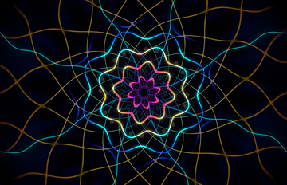

# Metal Screensavers for macOS

<div align="center">



**Two GPU-rendered screensavers: Hyperspace Bloom and Mandelbrot Saver**

[](https://www.apple.com/macos/)
[](https://developer.apple.com/metal/)
[](LICENSE)

</div>

This repository builds two independently installable screen savers:

- **Hyperspace Bloom** turns radial geometry into a continuously evolving mandala portal.
- **Mandelbrot Saver** renders continuous Mandelbrot and Julia deep-zoom journeys. Its source and detailed documentation live in [Mandelbrot/](Mandelbrot/README.md).

Both render locally with Metal and use no network access or source artwork.

## Hyperspace Bloom visual engine

- **Recursive portal depth** — log-polar repetition creates the impression of moving through an infinite geometric temple.
- **Four scene families** — Bloom, Temple, Weave, and Oracle are recombined from deterministic seeds.
- **Living symmetry** — automatic scenes move among 6-, 7-, 8-, 10-, and 12-fold structures without mid-scene popping.
- **Structured psychedelia** — layered petals, mirrored facets, luminous filigree, and pareidolic eye forms replace generic rainbow noise.
- **Six cyclic palettes** — Cosmic Orchid, Electric Lotus, Solar Temple, Abyssal Cyan, Woven Vision, and Pearl Void.
- **HDR output** — a 16-bit, extended-linear-sRGB pipeline uses available EDR headroom for luminous intersections without crushing the dark field.
- **Adaptive performance** — GPU frame timing disables supersampling first, then preserves a sharper resolution floor and accepts 30 fps before further softening.
- **Power awareness** — battery and Low Power Mode cap frame rate and render scale by default.

## Build and install

Requirements:

- Apple Silicon Mac
- macOS 12 or newer
- Xcode with the Metal toolchain

```bash
git clone https://github.com/ProofOfReach/MandelbrotSaver.git
cd MandelbrotSaver
./build.sh --install
```

If the Metal compiler is missing:

```bash
xcodebuild -downloadComponent MetalToolchain
```

The build creates `HyperspaceBloom.saver`, `MandelbrotSaver.saver`, `Hyperspace Bloom Settings.app`, and `Mandelbrot Settings.app`. Installation copies both savers to `~/Library/Screen Savers/` and both settings apps to `~/Applications/`; select either saver in **System Settings → Screen Saver**.

## Options

| Setting | Choices | Default |
|---|---|---|
| Motion | Dream → Voyage | Flow |
| Palette | Six curated palettes | Cosmic Orchid |
| Palette drift | On / Off | On |
| Symmetry | Automatic, 6, 7, 8, 10, 12 | Automatic |
| Complexity | Calm, Visionary, Maximum | Visionary |
| Quality | Standard, Ultra | Ultra |
| Battery saver | On / Off | On |

Changing symmetry starts a soft dissolve into a newly seeded scene. Settings are saved immediately and apply the next time the saver opens.

On macOS 26.0–26.5, Apple's legacy screen-saver host crashes before it can present third-party configuration sheets. Hyperspace Bloom and Mandelbrot hide that broken Options route on those releases; open **Hyperspace Bloom Settings** or **Mandelbrot Settings** from `~/Applications` instead. On unaffected macOS releases, the standard Options button remains available.

## Architecture

```text
macOS ScreenSaverView
        │
        ▼
MandalaView.swift
  • Direct HDR CAMetalLayer
  • Scene timeline and texture dissolves
  • Frame pacing, EDR, battery state
  • GPU-time quality governor
        │
        ├── MandalaScene.swift
        │     • Deterministic seeded scene generator
        │
        ├── Preferences.swift / ConfigureSheetController.swift
        │     • Shared persistent settings and native controls
        │
        ▼
Mandala.metal
  • Kaleidoscopic coordinate folding
  • Log-polar recursive chambers
  • Petal, filigree, facet, and eye geometry
  • Linear-light palettes, glow, and EDR tonemapping
```

The visuals use analytic 2.5D geometry rather than full raymarching. This retains the apparent tunnel depth while keeping native-resolution rendering practical on Apple Silicon.

## Verification

Run the full build and GPU audit:

```bash
./scripts/smoke-test.sh
```

The test verifies both products, including:

- Bundle identities, principal classes, signing, and arm64 architecture
- Deterministic scene generation and parameter ranges
- All four motifs and all six palettes through the compiled Metal library
- Image contrast, highlights, color presence, and central-jewel separation
- Deterministic pixel replay and the Ultra four-sample path

Audit renders are written to `.codex-outputs/render-audit/`.

## Privacy

Neither screen saver uses the network, reads personal files, collects telemetry, or downloads imagery. They render procedural geometry and store only their screen saver preferences.

## License

MIT. See [LICENSE](LICENSE).
