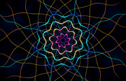

# Mandelbrot Screensaver

<div align="center">



[](https://opensource.org/licenses/MIT)
[](https://www.apple.com/macos/)
[](https://developer.apple.com/metal/)
[](https://github.com/ProofOfReach/MandelbrotSaver/releases)

**Real-time GPU-rendered Mandelbrot and Julia set screensaver for macOS**

### Quick Install

[Download Latest Release](https://github.com/ProofOfReach/MandelbrotSaver/releases/latest) → Unzip → Double-click → Done

</div>

---

## TL;DR

**The Problem**: macOS screensavers are boring. The built-in options are static images or basic animations. Third-party fractal viewers are either outdated, slow, or cost money.

**The Solution**: A free, GPU-accelerated Mandelbrot/Julia set screensaver that renders beautiful deep zooms at 60fps using Apple's Metal framework.

### Why Use This?

| Feature | What It Does |
|---------|--------------|
| **60fps Metal Rendering** | Buttery smooth zooms powered by your Mac's GPU |
| **Curated Color Palettes** | Six distinct looks instead of a long list of near-duplicates |
| **Julia Set Mode** | Switches from Mandelbrot targets to curated Julia constants |
| **Rich Color Palettes** | Distinct sRGB palettes tuned for smooth fractal coloring |
| **3D Lighting** | Optional Blinn-Phong shading with specular highlights |
| **Zero Config** | Works beautifully out of the box, customize if you want |

---

## Quick Example

```
1. Download MandelbrotSaver.saver.zip
2. Unzip
3. Double-click MandelbrotSaver.saver
4. Click "Install"
5. Open System Settings → Screen Saver → Select "Mandelbrot"
```

That's it. Your Mac now has a continuously zooming fractal screensaver.

---

## How It Compares

| Feature | Mandelbrot Saver | Electric Sheep | Fliqlo | Built-in macOS |
|---------|------------------|----------------|--------|----------------|
| GPU Accelerated | **Yes** (Metal) | No (CPU) | No | Partial |
| Continuous Zoom | **Yes** (cycles through locations) | No | No | No |
| Customizable | **Yes** (6 palettes, 4 shading modes) | Limited | No | Limited |
| Julia Sets | **Yes** | No | No | No |
| Free | **Yes** | Yes | Yes | Yes |
| Works Offline | **Yes** | No (needs network) | Yes | Yes |
| Multiple Palettes | **Yes** | No | No | Partial |

**Best for**: Anyone who wants a beautiful, mesmerizing screensaver that showcases their Mac's GPU.

**Not ideal for**: Users who prefer static images or clock-based screensavers.

---

## Installation

### From Release (Recommended)

No Xcode or developer tools required.

1. Download `MandelbrotSaver.saver.zip` from [Releases](https://github.com/ProofOfReach/MandelbrotSaver/releases/latest)
2. Unzip the file
3. Double-click `MandelbrotSaver.saver`
4. Choose "Install for this user only" (or "Install for all users" if you have admin rights)
5. Open **System Settings → Screen Saver** and select **Mandelbrot**

### From Source

Requires Xcode with Metal compiler.

```bash
git clone https://github.com/ProofOfReach/MandelbrotSaver.git
cd MandelbrotSaver
./build.sh --install
```

Build options:
```bash
./build.sh           # Build only (creates MandelbrotSaver.saver/)
./build.sh --install # Build and install to ~/Library/Screen Savers/
./scripts/smoke-test.sh # Build and verify bundle, signing, architectures, and Metal library
```

`build.sh` creates a universal Intel/Apple Silicon binary. If the Metal toolchain is missing, install it with:

```bash
xcodebuild -downloadComponent MetalToolchain
```

---

## Configuration

Click **Options** in System Settings → Screen Saver to customize:

| Setting | Options | Default |
|---------|---------|---------|
| **Zoom Speed** | Slow ← → Fast slider | Medium |
| **Palette** | 6 curated color schemes | Ultra Fractal |
| **Auto-cycle Palettes** | On/Off | On |
| **Visual Quality** | Standard, Ultra | Ultra |
| **Shading Mode** | Flat, 3D Blinn-Phong, Angle-based, Stripe | Flat |
| **Julia Set Mode** | On/Off (renders curated Julia sets instead of Mandelbrot targets) | Off |

### Palettes

- Ultra Fractal (classic blue-gold)
- Ember (red-orange-yellow)
- Abyss (deep blues and teals)
- Neon (cyan-magenta-green)
- Aurora (green-blue-purple)
- Graphite (black-to-white)

### Shading Modes

| Mode | Description |
|------|-------------|
| **Flat** | Classic smooth coloring based on escape iterations |
| **3D Blinn-Phong** | Simulated 3D surface with highlights and shadows |
| **Angle-based** | Colors derived from escape angle for psychedelic effects |
| **Stripe** | Orbital trap coloring with stripe patterns |

### Visual Quality

| Mode | Description |
|------|-------------|
| **Standard** | 1x rendering with conservative iteration caps |
| **Ultra** | Retina-scale rendering, higher iteration caps, safer smoothing, and full 3D lighting |

---

## Architecture

```
┌─────────────────────────────────────────────────────────────────┐
│                    macOS ScreenSaver Framework                   │
│                      (ScreenSaverView)                          │
└─────────────────────────────────────────────────────────────────┘
                            │
                            ▼
┌─────────────────────────────────────────────────────────────────┐
│                      MandelbrotView.swift                        │
│   - Animation state machine (zoom → fade out → fade in)         │
│   - Direct CAMetalLayer rendering                               │
│   - Curated zoom target locations                               │
└─────────────────────────────────────────────────────────────────┘
                            │
        ┌───────────────────┼───────────────────┐
        ▼                   ▼                   ▼
┌──────────────────┐ ┌──────────────────┐ ┌──────────────────┐
│ Mandelbrot.metal │ │ Preferences.swift│ │ ConfigureSheet   │
│ - GPU compute    │ │ - User settings  │ │ - Options UI     │
│ - 6 palettes     │ │ - Persistence    │ │ - No XIB needed  │
│ - Julia mode     │ └──────────────────┘ └──────────────────┘
│ - 4 shading modes│
│ - Retina Ultra   │
│ - perturbation   │
└──────────────────┘
```

**Key Design Decisions:**

1. **Metal Compute Shaders** - Each pixel computed independently on GPU for maximum parallelism
2. **Typed Shader Uniforms** - Swift and Metal share one compact parameter layout for render state
3. **Ultra Visual Quality** - Defaults to Retina-scale rendering and higher iteration caps for modern Apple Silicon
4. **Direct CAMetalLayer Rendering** - Uses an sRGB `bgra8Unorm_srgb` Metal layer to avoid screensaver subview compositing issues
5. **Perturbation-Assisted Deep Zooms** - Uses a CPU reference orbit and GPU perturbation path once the zoom gets deep
6. **Programmatic UI** - No XIB/NIB files, all configuration UI built in code

---

## Troubleshooting

### Screensaver doesn't appear in System Settings

**Cause:** Installation didn't complete or macOS security blocked it.

**Solution:**
```bash
# Check if installed
ls ~/Library/Screen\ Savers/

# Reinstall
./build.sh --install
```

Or manually copy `MandelbrotSaver.saver` to `~/Library/Screen Savers/`.

### Preview shows black screen

**Cause:** GPU initialization can take a moment on first launch.

**Solution:** Wait 2-3 seconds. If still black, try selecting a different screensaver and then re-selecting Mandelbrot.

### "Options" button is grayed out

**Cause:** System Settings quirk when screensaver first installed.

**Solution:** Close and reopen System Settings, or log out and back in.

### Still having issues?

1. Search [existing issues](https://github.com/ProofOfReach/MandelbrotSaver/issues)
2. Open a [new issue](https://github.com/ProofOfReach/MandelbrotSaver/issues/new) with:
   - macOS version
   - Mac model (Intel or Apple Silicon)
   - Screenshot of the problem

---

## Limitations

### What This Doesn't Do

- **No manual navigation** - This is a screensaver, not an interactive explorer. It auto-zooms to curated beautiful locations.
- **No arbitrary deep zoom** - Limited to ~10^5 zoom depth to maintain visual quality (deeper causes pixelation).
- **No Buddhabrot/Burning Ship** - Only standard Mandelbrot and Julia sets.
- **No Windows/Linux** - macOS only (uses Metal and ScreenSaver framework).

### Known Issues

| Issue | Workaround | Status |
|-------|------------|--------|
| First frame may stutter | Wait for GPU warmup | By design |
| Hot corners conflict | Disable hot corners or adjust trigger delay | macOS behavior |

---

## FAQ

### Why "Mandelbrot"?

Named after Benoit Mandelbrot, the mathematician who studied and popularized fractals. The Mandelbrot set is the most famous fractal, defined by the simple equation z = z² + c.

### Is this safe to install?

Yes. The code is open source and does exactly what it claims: render fractals. It doesn't access the network, read your files, or do anything except draw pretty pictures.

### Will this drain my battery?

Like any GPU-intensive task, it uses more power than a static screensaver. On laptops, macOS typically prevents the screensaver from running on battery unless you configure it otherwise.

### Can I use a specific zoom location?

Not currently. The screensaver cycles through curated locations compiled into the source. Adding custom locations requires modifying the source code.

### Why curated zoom targets?

Quality over quantity. Each location was hand-picked to look beautiful at all zoom levels without hitting precision limits. Adding arbitrary locations risks ugly artifacts.

### Does it work on Intel Macs?

Yes. The source build creates a universal binary for Intel and Apple Silicon Macs.

---

## Contributing

Pull requests welcome! Areas of interest:

- Additional palettes
- New shading modes
- Performance optimizations

---

## License

MIT License - Free to use, modify, and distribute.

See [LICENSE](LICENSE) for details.
